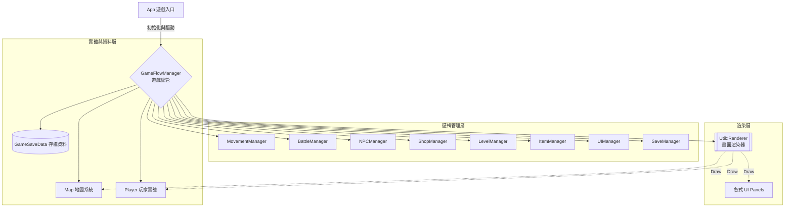
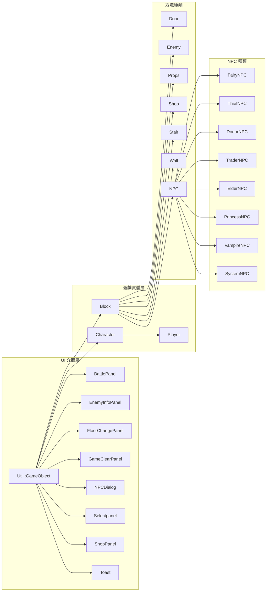
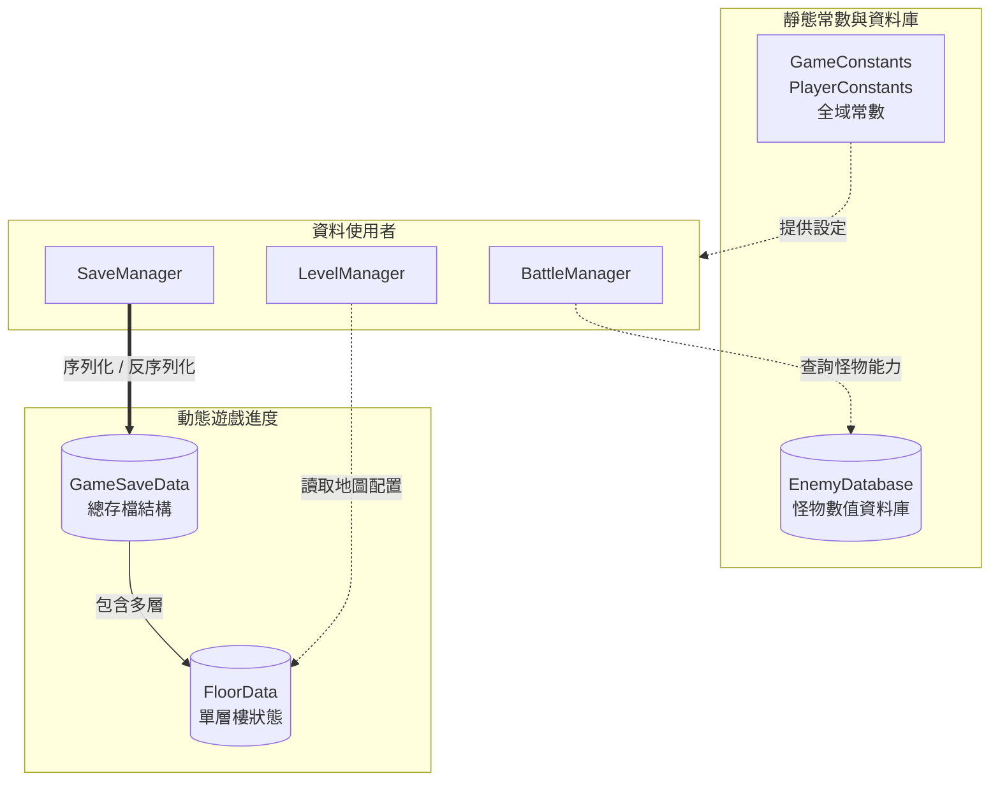

# 2026 OOPL Final Report

## 組別資訊
- 組別：62
- 組員：113590043 張婷棻
- 復刻遊戲：魔塔

## 專案簡介
### 遊戲簡介
- 本專案復刻之《魔塔V1.12》是一款經典的 PC 平台策略數值計算 RPG，核心玩法圍繞在計算戰鬥數值、鑰匙使用規劃及最佳攻打路徑等策略規劃。

### 組別分工
- 一人組別，所有內容由一人獨力完成

## 遊戲介紹
### 遊戲規則
- **遊戲操作**
  - Space - 確認
  - WASD - 操縱勇者移動
  - F - 使用風之羅盤 (樓層跳躍)
  - E - 使用聖光徽 (怪物手冊)
  - R - 重新開始
  - P - 儲存檔案
  - O - 讀取存檔 (顯示最新的前三個存檔)
- **攻擊規則**
  - 勇者攻擊1次，敵人攻擊1次
  - 勇者攻擊敵人
    - 傷害 = 勇者攻擊力 - 敵人防禦力
    - 勇者有機率打出兩倍傷害 (機率 : 勇者等級 * 0.5%)
  - 敵人攻擊勇者
    - 傷害 = 敵人攻擊力 - 勇者防禦力
    - 特定敵人有吸血效果，戰鬥前扣除勇者固定血量 or 固定比例血量
- **道具撿拾**
  - WASD - 觸碰道具，獲得道具
- **NPC對話**
  - WASD - 觸碰NPC，和NPC對話
  - Space - 下一句
- **開啟門**
  - WASD - 觸碰門，根據不同種類的門產生不同事件
    - 紅、藍、黃門 - 偵測是否有對應鑰匙決定是否開門
    - 鐵門 - 可直接開啟
    - 花門 (綠) - 由NPC觸發開啟
- **樓層上下**
  - WASD - 觸碰樓梯，觸發上下樓梯機制
- **商店購物**
  - WASD - 觸碰商店，開啟商店選擇介面
  - WA - 切換選項
  - Space -確認選項
- **聖光徽**
  - 位於一樓
  - E - 開啟or關閉介面
- **風之羅盤**
  - 位於九樓
  - F - 開啟or關閉介面
  - WA -切換樓層
  - Space -確認選項
- **作弊玩法**
  - 系統 - 於序章中，與之對話觸發作弊
   
  - 對話結果
    - 第一次對話 : 防誤觸對話，勇者無變化
    - 第二次對話 : 給予聖光徽、風之羅盤
    - 第三次對話 : 攻防等級全面提升，風之羅盤開啟作弊模式
     註 : 作弊一但開啟無反悔機制
     
### 劇情介紹
- 仙子
  - 序章 - 介紹遊戲背景，請求玩家找尋十字架(七樓)
   
   
  - 序章 - 從十六樓老人獲得神秘寶物後，與其對話，觸發通關劇情
    
  - 序章 - 獲得十字架後，與其對話，同時開啟二十樓上樓樓梯
   
   
  - 二十二樓 - 開啟二十三樓花門，要求玩家找尋剩下兩支靈杖，靈杖於左右樓梯找尋，花門位於下方樓梯
    
  - 二十二樓 - 收集到三支魔杖後將其交出，封印不可擊殺的魔龍成為可擊殺的血影
   
  
   
- 小偷
  - 四樓 - 開啟二樓花門，請求玩家找到紅寶石榔頭(十二樓)
   
  
   
  - 四樓 - 找到紅寶石榔頭後，將其交出，小偷敲掉十八層牆面
   
   
- 公主 
  - 十八樓 - 對話後開啟第十八樓上樓樓梯，請求勇者殺掉大魔王
   
   
- 神秘老人
  - 十六樓 - 對話後獲得神秘寶物，須找仙子解答
   註 : 原版有25分鐘限制，復刻取消該限制
    
- 冥靈魔王
  - 二十一樓 - 打敗後出現二十一樓上樓樓梯
   
   

  
### 遊戲畫面
|   階段   |                        遊戲畫面                        |
|:------:|:--------------------------------------------------:|
|  開始畫面  |    |
|  NPC對話  |   |
|  打鬥畫面  |    |
|  打鬥獎勵  |    |
|  撿取道具  |    |
|  商店畫面  |    |
|  怪物手冊(聖光徽) |  |
|  樓層飛行(風之羅盤)  |    |
|  Boss1  |    |
|  Boss2 |     |
|  儲存畫面 |     |
|  讀取畫面 |  |
| 勝利結束畫面 |  |

## 程式設計
### 程式架構

### 功能說明

#### 1. 遊戲實體與介面層 (繼承自 Util::GameObject)
  - `Util::GameObject` - 專案中的底層基礎可視遊戲物件
    - `Character` - 角色基礎類別
      - `Player` - 玩家控制的勇者實體
        1. 負責儲存與管理玩家數值 (PlayerStats)、背包狀態 (Inventory) 與座標。
    - `Block` - 地圖上的基礎方塊物件
      - `Wall` - 地圖上的牆壁
      - `Door` - 地圖上的門
      - `Enemy` - 地圖上的怪物
        1. 包含專屬怪物 ID，受到攻擊時會與 `EnemyDatabase` 進行數值連動與傷害計算。
      - `Props` - 地圖上的可拾取道具（如鑰匙、寶石、藥水、武器）
      - `Stair` - 地圖上的樓梯
      - `Shop` - 地圖上的商店
      - `NPC` - 地圖上可互動的 NPC 基礎類別
        - `FairyNPC` - 仙子 NPC
        - `ThiefNPC` - 小偷 NPC
        - `DonorNPC` - 贈予者 NPC
        - `TraderNPC` - 交易者 NPC
        - `ElderNPC` - 神秘老人 NPC
        - `PrincessNPC` - 公主 NPC
        - `VampireNPC` - 冥靈魔王 NPC
        - `SystemNPC` - 系統 NPC
    
    - **使用者介面群組 (UI Panels)**
      - `BattlePanel` - 戰鬥結算介面
        1. 顯示雙方血量扣減動畫、戰鬥回合計算與戰後獲得金幣/經驗提示。
      - `ShopPanel` - 商店購物介面
      - `Selectpanel` - 存讀檔選擇介面
        1. 掃描資料夾並格式化最新三個存檔的時間（如 `YYYY/MM/DD HH:MM:SS`），提供玩家選擇與讀取。
      - `NPCDialog` - 與 NPC 互動時的文字對話框介面
      - `EnemyInfoPanel` - 怪物手冊介面
        1. 動態讀取當前樓層存活的怪物，顯示其能力值與「預估受到的總傷害」（已包含暴擊與戰前固定/百分比扣血機制）。
      - `FloorChangePanel` - 樓層跳躍介面
      - `GameClearPanel` - 遊戲通關結算介面
      - `Toast` - 浮動提示訊息物件
        1. 用於顯示短暫的系統通知

---
#### 2. 靜態資料與存檔結構 (Data & Constants)
- `GameSaveData` - 遊戲總存檔結構（封裝玩家狀態與各樓層配置）
- `FloorData` - 單層樓的動態配置資料
- `EnemyDatabase` - 怪物狀態資料庫
- `GameConstants` / `PlayerConstants` - 遊戲全域常數設定檔
---

#### 3. 地圖系統 (Map)
- `Map` - 地圖管理系統
  1. 管理當前樓層的 2D 陣列配置、方塊實體儲存與渲染圖層。

---

#### 4. 系統邏輯控制層 (Manager)
- `BattleManager` - 戰鬥邏輯控制
  1. 負責計算破防傷害、暴擊倍率、怪物特殊屬性扣血，並將數值變化派發給 UI 更新。
- `MovementManager` - 移動邏輯與碰撞判定
- `NPCManager` - 管理所有 NPC 的對話進度與事件
- `ShopManager` - 管理商店選項數值與扣款加成邏輯
- `LevelManager` - 樓層配置管理
  1. 負責解析單層樓資料，並實體化對應的地圖方塊與 NPC。
- `ItemManager` - 道具獲得與效果套用邏輯
- `SaveManager` - 存檔與讀檔管理
  1. 負責檔案系統的讀寫，將 `GameSaveData` 序列化輸出或反序列化重建遊戲狀態。
- `UIManager` - 統籌所有 HUD 介面的顯示與隱藏狀態

---

## 5. 核心總管與入口 (Core)
- `GameFlowManager` - 遊戲總管
  1. 持有並調度上述所有的 Manager、UI 介面、玩家與地圖實體。
  2. 控制遊戲狀態，處理全域按鍵輸入，並防範玩家於 UI 開啟時移動。
- `App` - 主遊戲入口架構
  1. 負責維持系統生命週期 (`Start`, `Update`, `End`)。
  2. 攔截底層關閉指令 (`ESC`)，其餘遊戲邏輯全數轉交給 `GameFlowManager` 執行。

### 程式技術
### 程式技術與架構設計

- **物件導向設計 (OOP) 與多型應用**
  - **設計理念：** 將地圖上的靜態方塊除了玩家以外進行高度抽象化。設立 `Block` 為基底類別，向下衍生出「門、敵人、樓梯、物品、牆壁、商店、NPC」等七大子類別，並根據不同物件給予專屬編號。
  - **技術優勢：** 運用「多型」特性，讓地圖系統可以統一使用 `Block` 指標來管理所有物件。未來若需新增地形或機關，只需繼承並實作對應功能即可，大幅提升程式的擴充性。

- **解決上帝類別的中央調控架構的GameFlowManager**
  - **設計理念：** 為了避免遊戲主迴圈 `App` 變得過度龐大且難以維護，設計了 `GameFlowManager` 作為系統的中央大腦負責管理其他的Manager。
  - **技術優勢：** 達到「高內聚、低耦合」的架構目標。`GameFlowManager` 負責持有並調度所有的 Manager，並統一處理使用者的按鍵輸入。

- **狀態驅動的 NPC 腳本對話與資料保留**
  - **對話狀態機：** 針對多種類的 NPC 撰寫獨立子類別，並在其內部實作輕量級的狀態指標，記憶玩家當前的對話進度與互動狀態。
  - **資料保留：** 在 `FloorData` 結構中引入動態陣列 `std::vector` 來儲存已觸發或存在的 NPC 狀態。當玩家進行跨樓層移動時，系統能將這些舊有NPC保留，確保回到舊樓層時，NPC 的劇情進度與顯示情況能被正確還原。
  - **事件回調機制：** `NPCManager` 會根據 NPC 的當前狀態與玩家擁有的物品，給予相應的劇情處理，例如：增加玩家攻防、觸發特定物品劇情。

- **集中化的戰鬥演算核心BattleManager**
  - **設計理念：** 為了支援更複雜的戰鬥機制如概率暴擊，將原本分散的扣血與數值判斷邏輯合併並集中至 `BattleManager` 統一計算。
  - **技術優勢：** 作為戰鬥的唯一大腦，它會動態從 `EnemyDatabase` 抓取敵人數值，精準執行包含破防判定、暴擊倍率處理與特殊屬性扣血的完整戰鬥流程。最終再將結算的血量精確反映在勇者與怪物實體上，並發放獲勝獎勵，能夠將UI顯示血量在戰鬥後精準反映在勇者身上，避免畫面和實際數值不同步問題。

- **動態傷害預測系統EnemyInfoPanel**
  - **設計理念：** 在怪物手冊內部實作了「動態預測演算邏輯」會根據玩家的攻防，動態調整預計的損失血量。
  - **技術優勢：** 系統會即時抓取玩家當前的攻防能力，預先在背景執行一次包含暴擊、戰前固定扣血與百分比扣血的模擬戰鬥，並直接在介面上顯示「預估受到的總傷害」，提供玩家評估。
  - **更好的預測：** 原版的預測是只計算了一般的攻防，並不包含暴擊率。為了獲得更貼近實際結果的預測，我將暴擊率換算成比率平均加在每次攻擊上，使其更貼近實際戰鬥結果。 

- **儲存系統與讀檔處理 SaveManager**
  - **設計理念：** 實作存讀檔機制，方便玩家管理多個遊戲進度。
  - **技術優勢：** 運用 C++17 的 `<filesystem>` 函式庫，將地圖以及各項數值作為數字存入txt，在讀檔時系統能自動掃描本地存檔資料夾並篩選出最新進度。而檔案名稱則是抓取當前時間命名，在讀取時則轉換成易於閱讀的格式 `YYYY/MM/DD HH:MM:SS` 。
- **基於 Callback 與 Lambda 的事件驅動機制**
  - **設計理念：** 在處理系統互動（如戰鬥結算、商店購物等）時，為了避免底層邏輯層與顯示層產生相互依賴的「義大利麵條程式碼」，引入了事件委派機制。利用 C++ 的 `std::function` 在各模組宣告事件接口（如 `OnPlayerHpChanged`、`OnConfirmPurchase`），並在最高層的總管運用 C++11 的 Lambda 表達式 `[this](...){...}`，將資料變化與 UI 更新進行動態綁定。
  - **技術優勢：** 
    1. **雙向徹底解耦：** 實現了的單向資料流。邏輯大腦只需運算並「廣播」狀態改變，不需使用 `#include` UI 介面；反之，介面只需捕捉玩家點擊並「回傳」選項，不需知道後台是如何扣款的。
    2. **模組化與高靈活性：** 透過 Lambda 捕獲總管指標 `[this]`，將 A 模組的結果傳遞給 B 模組（例如戰鬥結束後觸發總管的 `ProcessBattleResult`）。這種設計是為了消除了類別間的雙向耦合，未來若需全面更換介面美術或抽換底層邏輯，另一方的程式碼皆能做到「零修改」，提升了架構的可擴展性。

### 使用到 AI/AI Agent 的部分
- **txt檔案的讀取與應用**
  - OOP課程並未教導如何寫入及讀取檔案，因此在資料的讀取與存檔皆有尋求AI幫助
- **Manager的分權管理**
  - 請教AI將原先寫於 `App` 內的程式碼拆入各個Manager
- **學習現代 C++ 語法與事件回調機制**
  - 向AI詢問了如何讓Manager在不認識UI介面的情況下也能通知畫面進行更新

## 結語
### 問題與解決方法
- **敵人兼NPC造成的菱形問題：** 
  1. 在19樓有隻冥靈魔王需要先對話才能戰鬥，但因為都是繼承於Block之下，會有菱形繼承問題，但是在仔細觀看攻略影片發現是在魔王的前一格方塊觸發對話，因此將魔王的前一格地板設為NPC，避免繼承衝突問題。
  2. 第21層的冥靈魔王攻擊結束後有對話，因此設計為在戰鬥結束後，直接呼叫對話框，並單獨注入對話。
- **NPC刷新問題：**
  1. 在離開樓層後所有方塊皆會被清除，因此下一次來到該樓層，看到的會是完全沒對話過的NPC，因此在 `FloorData` 裡增加 `std::vector` 儲存該樓層的NPC使其保持記憶。
- **上帝類別與依賴問題：**
  1. 開發初期為了方便，將大量程式碼集中於 `App`，後進行大規模系統重構，引入 `GameFlowManager` 統管所有邏輯。`App` 僅負責系統生命週期與攔截底層關閉指令，其餘的資源分配與更新全部下放。這大幅減少了類別之間的互相 #include，也讓程式碼的職責變得清晰。

- **標頭檔互相引入導致的編譯過長：**
  1. 隨著專案規模變大，每次修改一個小小的 Player.hpp 或常數檔，都會觸發數十個 .cpp 檔案的連鎖重新編譯，導致開發與測試的等待時間極長。因此根據AI建議在 .hpp 標頭檔中以 class XXX; 取代直接 #include，並將真正的 #include 移至 .cpp 實作檔中。

### 自評
| 項次 | 項目                      | 完成 |
|:--:|-------------------------|:--:|
| 1  | 完成專案權限改為 public         | V  |
| 2  | 具有 debug mode 的功能       | V  |
| 3  | 解決專案上所有 Memory Leak 的問題 | V  |
| 4  | 報告中沒有任何錯字，以及沒有任何一項遺漏    | V  |
| 5  | 報告至少保持基本的美感，人類可讀        | V  |

### 心得
&nbsp;&nbsp;&nbsp;&nbsp;一開始知道要做出一款遊戲的時候還是非常擔心的，因為即使是OOP也都停留在文字上的階段並未教到如何結合畫面，但也好在當今時代AI發達，省去許多上網爬資料的時間。不過除了不熟悉以外，另一個問題是，我不太確定自己的能力到哪裡，以及我也並沒有太多遊戲經歷，因此選擇了兩位助教推薦的《魔塔》遊戲，也很感謝景喬助教提供的美術資源以及一些製作上的建議。至於遊戲版本則是因為在B站上找到一個相對詳細的攻略解說，因此決定復刻該版本。在開始製作後遇到的第一個難點是我對於地圖上的一切都不熟悉，因此需要一個一個看攻略影片了解該物品的用途及用法，也因此耗費了不少時間，但正因如此我對於遊戲的認識有了大幅度的提升，並且完全了解遊戲通關邏輯是什麼。  
&nbsp;&nbsp;&nbsp;&nbsp;在製作遊戲的時候也理所當然遇到許多問題，需要和AI鬥智鬥勇，有時候發現和AI在雞同鴨講後會選擇直接放棄溝通，寧願用迂迴的方式撰寫達到自己想要的效果，尤其是在讀取檔案的時候NPC重建的問題。但從這裡讓我學到不能過度依賴工具，有時候自己的想法和理解也非常重要，對於親自梳理出來的寫法雖迂迴但是至少是自己可控的，才能保證整個專案的穩定。  
&nbsp;&nbsp;&nbsp;&nbsp;至於AI提供最大的幫助就是debug，許多小地方都是因為一些沒注意到的地方而產生嚴重bug，有了AI的幫助就能快速debug，因此省下了不少時間，而這次作業也讓我了解到了如何從頭開始一步一腳印的製作一個龐大的遊戲架構，我也學到許多貪圖方便的小地方最後可能都導致整個架構依賴性太高，如果要改就必須從頭一層一層修上來，因此在初期規劃就顯得尤為重要。  
&nbsp;&nbsp;&nbsp;&nbsp;總結來說，看著《魔塔》從一堆零散的程式碼，逐漸成型為一個具備完整物件導向架構、可流暢遊玩的成品，這份成就感是難以言喻的。這次專案不僅讓我將OOP的理論徹底實踐，更培養了我解決未知問題與規劃系統架構的能力，為我未來的軟體開發之路打下了堅實的基礎。
### 貢獻比例
|      組員       | 貢獻度  |
|:-------------:|:----:|
| 113590043 張婷棻 | 100% |
